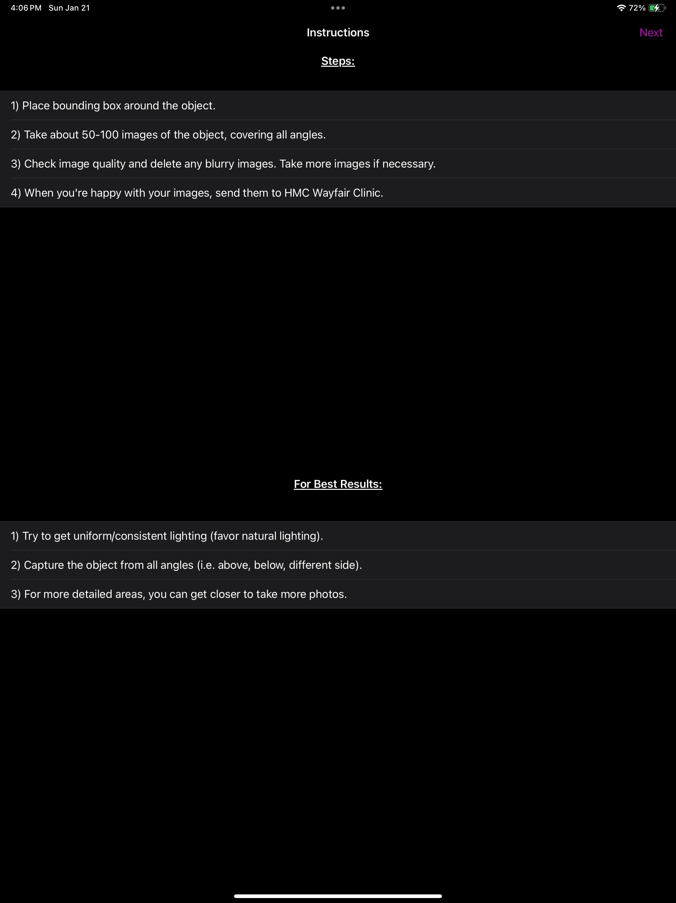

# NeRF Capture 
 


Collecting NeRF datasets is difficult. NeRF Capture is an iOS application that allows any iPhone or iPad to quickly collect or stream posed images to [InstantNGP](https://github.com/NVlabs/instant-ngp). If your device has a LiDAR, the depth images will be saved/streamed as well. The app has two modes: Offline and Online. In Offline mode, the dataset is saved to the device and can be accessed in the Files App in the NeRFCapture folder. Online mode uses [CycloneDDS](https://github.com/eclipse-cyclonedds/cyclonedds) to publish the posed images on the network. A Python script then collects the images and provides them to InstantNGP.

<a href="https://apps.apple.com/us/app/nerfcapture/id6446518379?itsct=apps_box_badge&amp;itscg=30200" style="display: inline-block; overflow: hidden; border-radius: 13px; width: 150px; height: 53px;"></a>


## Instructions View


These instructions help the user when they initially open up the app. It breaks down what the user should do in future steps and recommends how they can can get the best resulting model. There is a *next* button in the top right of the view to take the user to the next view.

## Bounding Box View


In this view the user can create an edit a bounding box to closely surround the object that they are taking pictures of. The user can:
* move the box around
* rotate the box
* scale the box
* extend the sides of the box.
This will help the app track the location of the object in each frame, and help the server process the model faster.

## Taking Images View


In this view the user can take images. According to the *Intro Instructions* it is recommended that the user takes between 50-100 images. In order to initiate the image taking session, the user has to first press the *Start* button. Once the *Start* button is pressed, the *Reset*, *Start*, and *Send* buttons will be replaced by *End* and *Save Frame* buttons.


In order to take images, the user needs to press the *Save Frame* button. As the user takes images the number of frames tracked will increase. The user needs to press the *End* button to end the image taking session and the *Next* button in the top right corner to view the images.

## Grid View


In this view the user can check the images they took, delete usable images, and go back to take more images. In order to see the image in greater detail, the user can click on the image to see this view:


## Online Mode


Use the Reset button to reset the coordinate system to the current position of the camera. This takes a while; wait until the tracking initialized before moving away.

Switch the app to online mode. On the computer running InstantNGP, make sure that CycloneDDS is installed in the same python environment that is running pyngp. OpenCV and Pillow are needed to save and resize images.

```
pip install cyclonedds
```

Check that the computer can see the device on your network by running in your terminal:

```
cyclonedds ps
```

Instructions found in [here](https://github.com/NVlabs/instant-ngp/blob/master/docs/nerf_dataset_tips.md#NeRFCapture)


## Offline Mode

In Offline mode, clicking start initializes the dataset. Take a few images then click End when you're done. The dataset can be found as a zip file in your Files App in the format that InstantNGP expects. Unzip the dataset and drag and drop it into InstantNGP. We have found it farely difficult to get files transferred from an iOS device to another computer so we recommend running the app in Online mode and collecting the dataset with the nerfcapture2nerf.py script found in InstantNGP.


If you use this software in your research, please consider citing it. 


