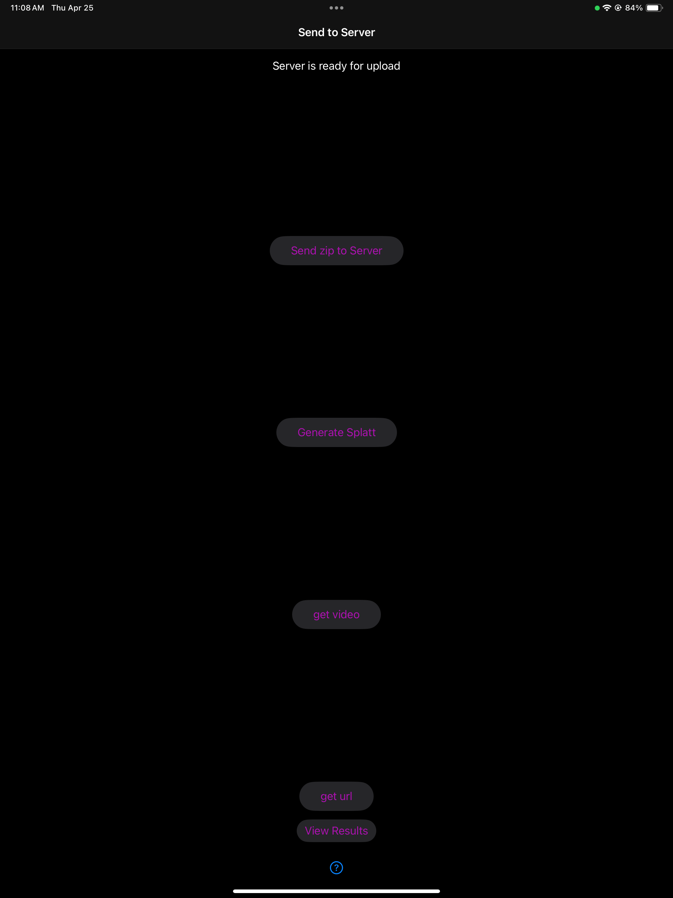

# User Guide
## Instructions View
### Instructions
These instructions help the user when they initially open up the app:
<br>

<br>

It breaks down what the user should do in future steps and recommends how they can can get the best resulting model.

### Start Project
There is a *Start Projext* button at the bottom of the screen, which the user presses to enter the name of their project. Once the project is started, this will pop up:
<br>

<br>

The user can enter any name they want for the project, then press the submit button to go to the next step.

## Bounding Box View
### Box Placement
The user is first prompted to place the bounding box the same surface that the product is on:
<br>

<br>

This is done by tapping on the screen:
<br>

<br>

### Enter Dimesions
Once the bounding box is placed, the user then enters the dimensions of the product. This is the second step because users of this app will usually already know the dimensions of their product.
<br>

<br>

### Adjustments
The last part of creating the bounding box is making adjustments. In this part the user can:
<br>
Translate the Bounding Box
<br>

<br>
Rotate the Bounding Box
<br>

<br>
Re-scale the Bounding Box
<br>

<br>
Extend the Sides of Bounding Box
<br>

<br>
This will help the app track the location of the object in each frame, and help the server process the model faster.

## Taking Images View
### Start Image Taking
<br>

<br>
In this view the user can take images. According to the *Intro Instructions* it is recommended that the user takes between 50-100 images. In order to initiate the image taking session, the user has to first press the *Begin Capture* button. 

### Automatic Capture
Once the *Begin Capture* button is pressed, the *Begin Capture* and *View Gallery* buttons will be replaced by *Pause Automatic Capture* and *View Gallery* buttons:
<br>

<br>
The app will let the user know if they need to speed up or slow down their movement around the product by showing the user their velocity and letting them know if their speed is appropriate. The automatic image taking will also speed up if the user is only moving slightly too fast or slow down if the user is only moving slightly too slow. Just so the user is aware of when images are being taken, the scene flashes each time an image is taken. The user can also pause the image taking session by pressing the *Pause Automatic Capture* button:
<br>

### Image Distribution
We also let the user know the distribution of images around the product by changing the color and opacity of the faces of the bounding box as images are being taken. Currently, we have the goal number of images taken per side set to 10. This is what the face of a bounding box looks like before images are taken of that side:
<br>

<br>
This is what the face of a bounding box looks like when 4 out of 10 images are taken of a side:
<br>

<br>
This is what the face of a bounding box looks like when 10+ out of 10 images are taken of a side:
<br>

<br>
This is what the bounding box looks like when you start taking images of another side:
<br>

<br>
This is what the bounding box looks like when you finish taking images of the other side:
<br>

<br>
Once the user is done taking images of every side of the product, the bounding box faces will be transparent. They can move on to looking at the images they took by pressing the *View Gallery* button.

## Gallery View
### Grid View
This is what they gallery view first looks like to a user when they move on from the image taking view:
<br>

<br>
In this view the user can check the images they took, delete usable images, and go back to take more images. 
### Detail View
In order to see the image in greater detail, the user can click on the image to see this view:
<br>

<br>
To go back to the grid view from here, they can press the *Image Gallery* button in the top left corner. 
### Edit Collection View
Once the user looks at the images and figures out which one(s) they want to delete, they can click the *Edit* button in the top right corner to get this view:
<br>

<br>
In this view they can delete the images that are too blurry/don't have a good new view of the object.
### Retake Images
If they want to retake images to replace the ones they deleted, they can press the *Back to Camera* button on the bottom left side of the view. This button will bring the user back to this view:
<br>

<br>
Once the user is satisfied with the images that they've compiled after viewing them in the gallery view, they can move onto sending the images over to the server by pressing the *Send Data to Server* button.

## Send Images to Server View



This view has 5 buttons that should be press in the order that they are presented on the screen. To start the process of generating a 3D model on the server side, the user should first press the *Send zip to Server* button. The user will be notified when this process is done. Then they can move on to pressing the *Generate Splatt* button, which will generate the 3D model from gaussian splatts. To view their model, the user should press *get video*. The button *get url* is available for the user to be able to view their 3D model on the Web View. The user can also have direct access to their results by pressing the *View Results* button.

# Developer Guide
## Running the App
Follow this guide to get the project in your xcode:
<br>
[Xcode Repo Tutorial](https://developer.apple.com/documentation/xcode/configuring-your-xcode-project-to-use-source-control#Get-a-project-from-a-remote-repository)
<br>
Once the repository is cloned into your xcode, set the device that you want to run this app on as the run destination. Then run the app by pressing the traingle-shaped button in the top left.

## File Directory Overview

## Breaking Down the Code

### Intro Instructions View
#### Instructions View
This area just contains text that is stored in 2 lists of strings. One list contains a list of instructions on taking images, and the other list contains a list of best practices for getting quality images


#### Intro Instructions View
This contains the *Instructions View* and the *Start Project Button*. When the *Start Project Button* is pressed, an alert is created. This alert contains a submit button, which takes the user to the *BoundingBoxSMView*

#### Bounding Box SM View
This contains all the user-facing code for placing and editing the bounding box. The "SM" in the name stands for state machine, and this view consists of three states -- `IdentifyFloor`, `InputDimensions`, and `PlaceBox`. Each state will render within the `BoundingBoxSMView` their own view `IdentifyFloorView`, `InputDimensionsView`, and `PlaceBoxView` (Link to code). To switch between views, change `BoundingBoxSMView.content` to one of the statements. For example, to rendering `IdentityFloor` do `BoundingBoxSMView.content = BoundingBoxPlacementStates.IdentifyFloor`.

The states are rendered in the order of `IdentifyFloor` -> `InputDimensions` -> `PlaceBox`:

##### `IdentifyFloor`
The goal of this state is to allow the user to place the bounding box on the same surface as the object they are capturing.
The behavior related to this state is implemented in `BoundingBoxSMView.swift` and `BoundingBoxSM-IdentifyFloor.swift`. In `BoundingBoxSMView.swift`, there exists a tap gesture recognizer (`.onTapGesture`). When the user taps on the screen and the app is in `IdentifyFloor` state, we call the `viewModel.findFloorHeight(at: location, frame: frame)` and `viewModel.raycast_bounding_box_center(at:location, frame: frame)`. Within `BoundingBoxSM-IdentityFloor`, only logic to initially rendering the bounding box (`init` function) and some instructions to the user.

##### `InputDimensions`
The goal of this state is to allow the user to input the dimension of the object. The UI displays three sliders, each controlling dimension along a particular axis. 
[The unit is by default equivalent to meters](https://developer.apple.com/videos/play/wwdc2023/10081/#:~:text=Because%20RealityKit%20works%20in%20real,ready%20to%20play%20the%20video.).

##### `PlaceBox`
The goal of this state is to perform finetuning of the bounding box (We acknowledge that the name `PlaceBox` is outdated and no longer appropriate.) `PlaceBox` gives the user five ways to edit the bounding box: 1) teleport 2) translate 3) rotate 4) scale 5) extend. Teleport is implemented by the same gesture control for `IdentifyFloor` in the file `BoundingBoxSMView.swift` using the function `viewModel.raycast_bounding_box_center`. Whever the user taps the screen, the screen location is passed to the function and the box is placed at x,z coordinate of the intersection between the ray from the tapped position and a surface in the physical world. Since only the x,z coordinates are changed, the box will appear to slide along the "floor" indicated by the user in `IdentifyFloor`.
The rest of the edit methods are implemented as helper views in `BoundingBox.swift`. 
- `MovementControlsView` controls the translation of the box. The box will translate in the reference frame of the camera, which is not neccessarily axis aligned to the world coordinates. This means it respects the orientation of the device.
- `RotateControlsView` controls the rotation of the box about the y-axis (vertical axis). The user input will be taken in degrees, but internally it will be converted to radians.
- `ScaleControlsView` controls the dimension of the box. This works exactly the same as `InputDimensions`.
- `ExtendControlsView` controls the location of each end of a side. In contrast, `ScaleControlsView` will change the position of both ends of a side and keep the midpoint unchanged. This is usually more helpful than `ScaleControlsView` when trying to fit the boundingbox to an already enclosed object.

Each helper view calls methods of an `ARViewModel` object called `viewModel`. For example, the translate view (`MovementControlsView`) makes the following call
```
box_center = viewModel.set_center(new_center: box_center)
```
Notice that `box_center` is set to the return value of the function. Methods in `viewModel` for controls return the most up to date values for parameters of the bounding box that were changed. In this case, the value of `box_center` before and after the function call are the same. However, the call to `viewModel.extend_sides` in the `ExtendControlsView` View cause the value of box parameters to diverge.
``` 
(box_center, slider_xyz) = viewModel.extend_sides(offset: [0,0,-0.1])
```
Therefore, it is important for use the return values of the viewModel to update the corresponding states in `BoundingBoxSMView`. (The eagle eye reader might notice that this is only neccessary when the input to the function is some sort of offset, but it is safer to assume all functions in viewModel can update the parameters of the box).

The final implementation detail of this state is switching between different modes. To switch between modes 2 - 5, a `Picker` UI is used to pick values of an Enum `MovementModes`. The UI to display is controls using a series of `if` statements. Mode 1 is always active, so the user can always tap to teleport the bounding box.

#### Taking Images View


#### Image Gallery View


#### Send to Server View
The goal of this view is to send data to and from the server (`http://osiris.cs.hmc.edu:15002/`). The following endpoints are used.
| Server Endpoint              | Purpose |
| :---------------- | :------ |
| `/status`        |   GET server status   |
| `/upload_device_data`    |  POST all data (in zip) and splatt name; starts rendering  |
| `/download_video/{splatt_name}`           |   GET rendered preview video   |
| `/get_webviewer_link/{splatt_name}` |  GET detailed view website link   |

These are standard endpoints and you can interface with them in manys ways. Here is how we do it in the app using helper functions that internally call `URLSession.shared.dataTask`:
* `/status`
```
let urlString = "http://osiris.cs.hmc.edu:15002/status"
makeGetRequest(urlString: urlString) { data, response, error in
    pollServerStatus(data: data, response: response, error: error)
}
```
* `/upload_device_data`
```
let urlString = "http://osiris.cs.hmc.edu:15002/upload_device_data"
let directoryPath = viewModel.datasetWriter.projectDir
let zipPath = convertDirectoryPathToZipPath(directoryPath: directoryPath.absoluteString)
uploadZipFile(urlString: urlString, zipFilePath: URL(string: zipPath)!, splatName: viewModel.datasetWriter.projectName)
```
* `/download_video/{splatt_name}`
```
let videoUrlString = "http://osiris.cs.hmc.edu:15002/download_video/\(viewModel.datasetWriter.projName)"
downloadVideo(urlString: videoUrlString, splatName: viewModel.datasetWriter.projName)
```
* `get_webviewer_link/{splatt_name}`
```
let webViewerUrlString = "http://osiris.cs.hmc.edu:15002/get_webviewer_link/\(viewModel.datasetWriter.projName)"
getWebViewerUrl(urlString: webViewerUrlString, splatName: viewModel.datasetWriter.projName) { url, error in
    if let error = error {
        print("Error fetching URL: \(error.localizedDescription)")
    } else if let url = url {
        print("Web Viewer URL: \(url)")
        // saves the url
        viewModel.datasetWriter.webViewerUrl = url
    }
}
```

Functionally, this view is quite simple. The app continuously polls the `/status` endpoint every `1s` (can be configured) and prints the server status at the top of the screen. The user can press a button called "Begin Rendering" to post the zip file containing all the app data (boundingbox.json, images, etc) with ` viewModel.datasetWriter.projName` as the splatt name to the server. This triggers all rendering steps on the server, starting with preprocessing and ending with generating the preview video. While the server is working, the app's status message will track the progress every `1s`. After checking the status and detecting the status as `rendering_ended`, the app will automatically send GET requests to `/download_video/{splatt_name}` and  `get_webviewer_link/{splatt_name}` to get the preview video and url. Here, there is the assumption that both the preview video and webviewer_link are available when rendering ends, which is currently true. The preview video will be saved at `NeRF Capture/{splatt_name}.mp4` in the file directory, and the url will be saved within the `viewModel` object (`viewModel.datasetWriter.webViewerUrl`).

#### Video View
The goal of this view is to relay information from the server to the user. It plays the preview video saved at `NeRF Capture/{splatt_name}.mp4`, has a clickable link leading to the url saved at `viewModel.datasetWriter.webViewerUrl`. Finally, the user can on a button called "Return to Start" to return to the `IntroInstructionView`. Since there is no current way to view data from another session, returning to the start will be treated as an entirely new session. Also note that this functionality is currently bugged, specifically, on the second run, whil image data is saved to a project bearing the project name of the new session, the `SendImagesToServerView` and `VideoView` sometimes still use the name of the initial project. More on this in the [bugs section](#Known-Bugs).


### Bounding Box
#### Parameters

#### Rendering

`createLine` to render the lines.
`createSquare` -- pretty sure useless right?
`createPlaneFromCorners` to render the planes
`createBoundingBox`
`addNewBoxToScene`

ARViewModel
`display_box`
#### Updating


#### Saving

## Known Bugs