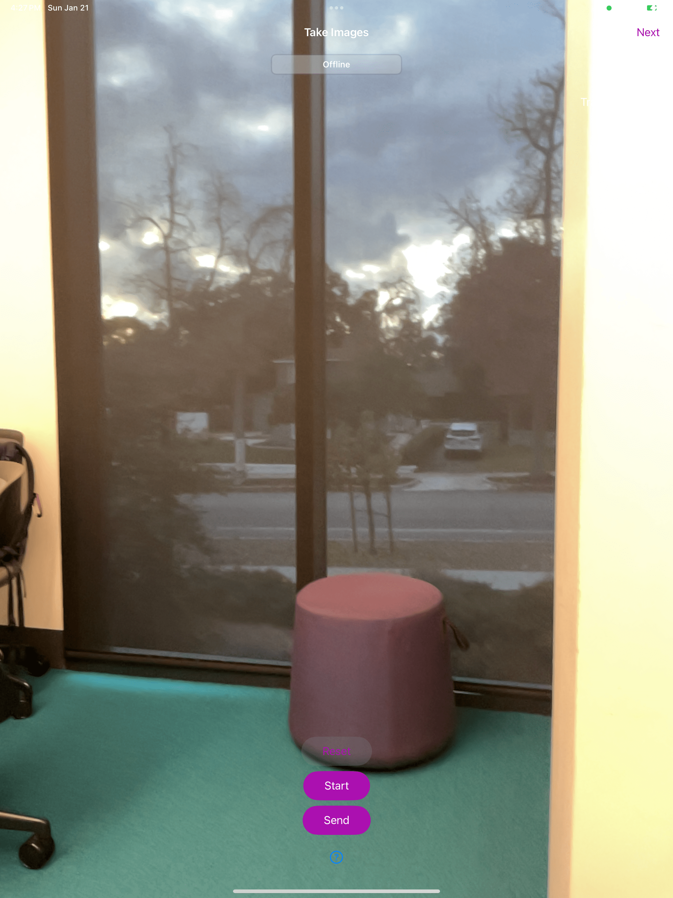
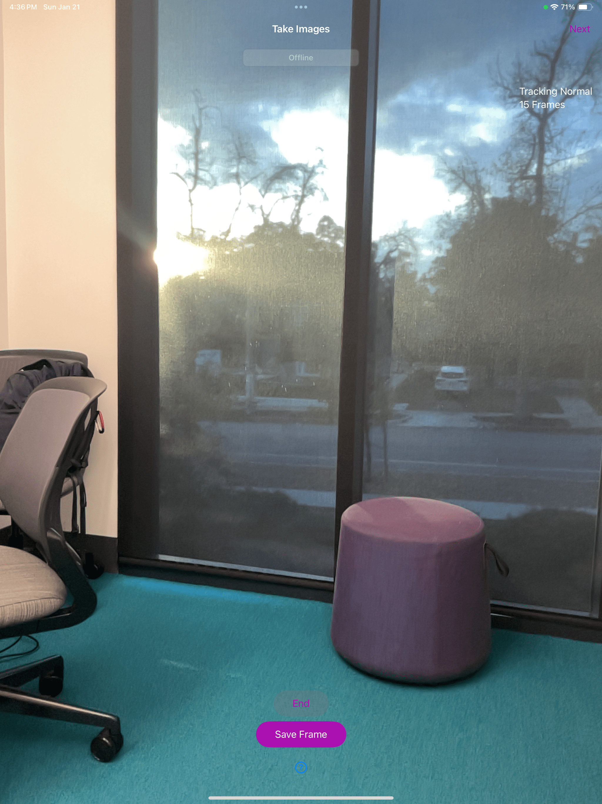
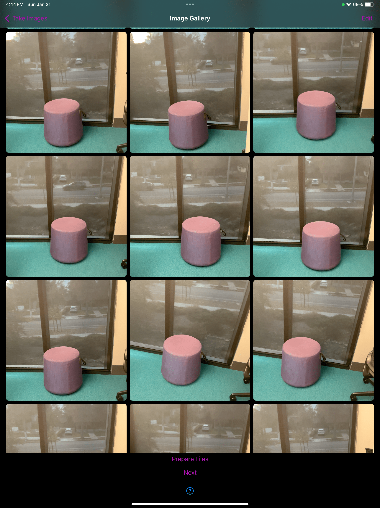
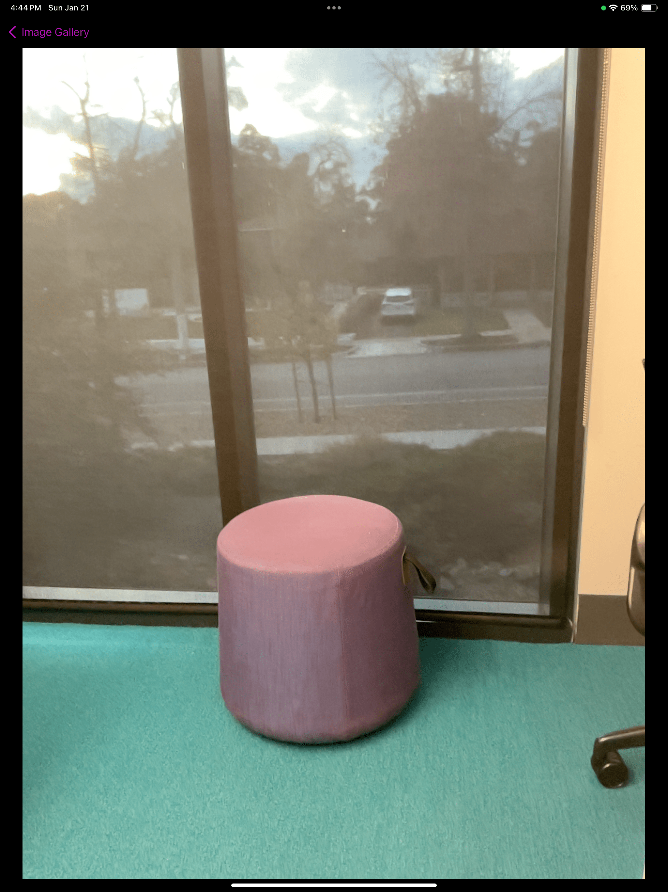
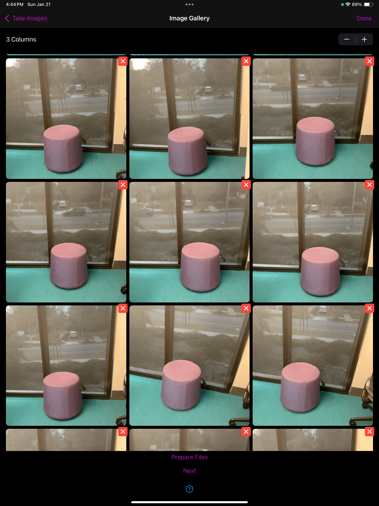
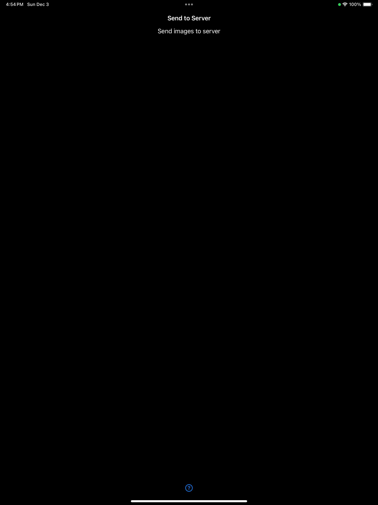

## Instructions View
These instructions help the user when they initially open up the app:
 

 

It breaks down what the user should do in future steps and recommends how they can can get the best resulting model. There is a *Start Projext* button at the bottom of the screen, which the user presses to enter the name of their project. Once the project is started, this will pop up:
 

 

The user can enter any name they want for the project, then press the submit button to go to the next step.

## Bounding Box View
The user is first prompted to place the bounding box the same surface that the product is on:
 

 

This is done by tapping on the screen:
 

 

Once the bounding box is placed, the user then enters the dimensions of the product. This is the second step because users of this app will usually already know the dimensions of their product.
 

 

The last part of creating the bounding box is making adjustments. In this part the user can:
Translate the Bounding Box
 

 
Rotate the Bounding Box
 

 
Re-scale the Bounding Box
 

 
Extend the Sides of Bounding Box
 

 

In this view the user can create an edit a bounding box to closely surround the object that they are taking pictures of. The user can:
* move the box around
* rotate the box
* scale the box
* extend the sides of the box.
This will help the app track the location of the object in each frame, and help the server process the model faster.

## Taking Images View

In this view the user can take images. According to the *Intro Instructions* it is recommended that the user takes between 50-100 images. In order to initiate the image taking session, the user has to first press the *Start* button. Once the *Start* button is pressed, the *Reset*, *Start*, and *Send* buttons will be replaced by *End* and *Save Frame* buttons.

In order to take images, the user needs to press the *Save Frame* button. As the user takes images the number of frames tracked will increase. The user needs to press the *End* button to end the image taking session and the *Next* button in the top right corner to view the images.

## Grid View

In this view the user can check the images they took, delete usable images, and go back to take more images. In order to see the image in greater detail, the user can click on the image to see this view:

Once the user looks at the images and figures out which one(s) they want to delete, they can click the *Edit* button in the top right corner to get this view:

In this view they can delete the images that are too blurry/don't have a good new view of the object. If they want to retake images to replace the ones they deleted, they can press the *Take Images* button in the top left corner. To move on, they can press the *Next* button at the bottom of the page.

## Send Images to Server View

This view is currently just a placeholder for the progress bar that shows how much model creation time is left.

