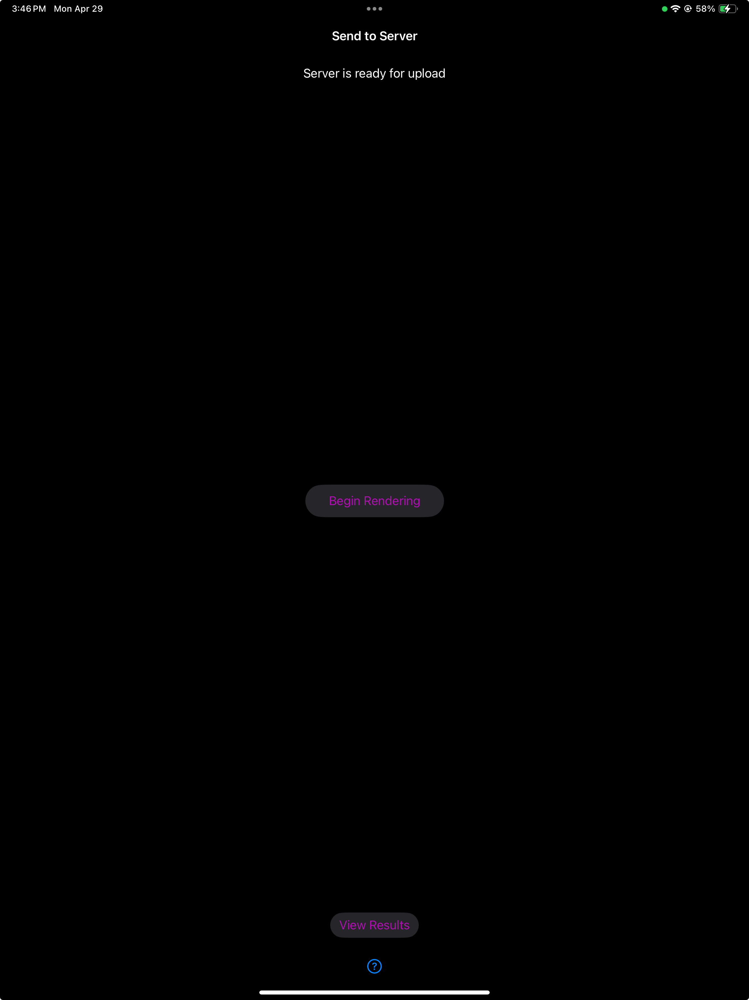

# User Guide

## Instructions View

### Instructions

These instructions help the user when they initially open up the app:
<br>

<br>

It breaks down what the user should do in future steps and recommends how they can can get the best resulting model.

### Start Project

There is a _Start Projext_ button at the bottom of the screen, which the user presses to enter the name of their project. Once the project is started, this will pop up:
<br>

<br>

The user can enter any name they want for the project, then press the submit button to go to the next step.

## Bounding Box View

### Box Placement

The user is first prompted to place the bounding box the same surface that the product is on:
<br>

<br>

This is done by tapping on the screen:
<br>

<br>

### Enter Dimesions

Once the bounding box is placed, the user then enters the dimensions of the product. This is the second step because users of this app will usually already know the dimensions of their product.
<br>

<br>

### Adjustments

The last part of creating the bounding box is making adjustments. In this part the user can:
<br>
Translate the Bounding Box
<br>

<br>
Rotate the Bounding Box
<br>

<br>
Re-scale the Bounding Box
<br>

<br>
Extend the Sides of Bounding Box
<br>

<br>
This will help the app track the location of the object in each frame, and help the server process the model faster.

## Taking Images View

### Start Image Taking

<br>

<br>
In this view the user can take images. According to the *Intro Instructions* it is recommended that the user takes between 50-100 images. In order to initiate the image taking session, the user has to first press the *Begin Capture* button.

### Automatic Capture

Once the _Begin Capture_ button is pressed, the _Begin Capture_ and _View Gallery_ buttons will be replaced by _Pause Automatic Capture_ and _View Gallery_ buttons:
<br>

<br>
The app will let the user know if they need to speed up or slow down their movement around the product by showing the user their velocity and letting them know if their speed is appropriate. The automatic image taking will also speed up if the user is only moving slightly too fast or slow down if the user is only moving slightly too slow. Just so the user is aware of when images are being taken, the scene flashes each time an image is taken. The user can also pause the image taking session by pressing the _Pause Automatic Capture_ button:
<br>

### Image Distribution

We also let the user know the distribution of images around the product by changing the color and opacity of the faces of the bounding box as images are being taken. Currently, we have the goal number of images taken per side set to 10. This is what the face of a bounding box looks like before images are taken of that side:
<br>

<br>
This is what the face of a bounding box looks like when 4 out of 10 images are taken of a side:
<br>

<br>
This is what the face of a bounding box looks like when 10+ out of 10 images are taken of a side:
<br>

<br>
This is what the bounding box looks like when you start taking images of another side:
<br>

<br>
This is what the bounding box looks like when you finish taking images of the other side:
<br>

<br>
Once the user is done taking images of every side of the product, the bounding box faces will be transparent. They can move on to looking at the images they took by pressing the _View Gallery_ button.

## Gallery View

### Grid View

This is what they gallery view first looks like to a user when they move on from the image taking view:
<br>

<br>
In this view the user can check the images they took, delete usable images, and go back to take more images.

### Detail View

In order to see the image in greater detail, the user can click on the image to see this view:
<br>

<br>
To go back to the grid view from here, they can press the _Image Gallery_ button in the top left corner.

### Edit Collection View

Once the user looks at the images and figures out which one(s) they want to delete, they can click the _Edit_ button in the top right corner to get this view:
<br>

<br>
In this view they can delete the images that are too blurry/don't have a good new view of the object.

### Retake Images

If they want to retake images to replace the ones they deleted, they can press the _Back to Camera_ button on the bottom left side of the view. This button will bring the user back to this view:
<br>

<br>
Once the user is satisfied with the images that they've compiled after viewing them in the gallery view, they can move onto sending the images over to the server by pressing the _Send Data to Server_ button.

## Send Images to Server View



This view only has 2 buttons and a status message at the top. To start the process of generating a 3D model on the server side, the user should first press the *Begn Rendering* button. The user will be notified when this process is done by reading the status message. When the status message switches from *Server finished rendering video* to *Server is ready for upload*. The user can also have direct access to their results by pressing the _View Results_ button.

## Video View


In this view, the user can press the video to play a preview of the generated 3D model. To get a better look at the model, the user can press the *Open Web Viewer* button to go to a detailed view. On the Web Viewer, the user can use a single finger to rotate the object, use two fingers to move the object, and pinch to zoom in. Finally, back in the app view, the user may *return to start* to create another 3D model. After this point, the user can only view their current model on the Web Viewer.

# Developer Guide

## Set Up/Installation
Follow this guide to get the project in your xcode:
<br>
[Xcode Repo Tutorial](https://developer.apple.com/documentation/xcode/configuring-your-xcode-project-to-use-source-control#Get-a-project-from-a-remote-repository)
<br>
Once the repository is cloned into your xcode, set the device that you want to run this app on as the run destination. Then run the app by pressing the traingle-shaped button in the top left.


## File Structure and File Description
Here are the key files for the app
```
HMCClinicNeRFApp
│   ├── README.md   
│   │
│   └── NeRFCapture
│       ├── DDSModel
│       ├── Models
│       │   ├── AppState.swift
│       │   ├── BoundingBoxManifest.swift
│       │   └── Manifest.swift
│       ├── Networking
│       ├── Preview Content
│       ├── Resources
│       │   ├── Disappear.mp3
│       │   └── Sparkle.mov (Unused)
│       ├── ViewModels
│       │   └── ARViewModel.swift
│       ├── Views
│       │   ├── ARViewContainer.swift
│       │   ├── BoundingBox-SummaryView.swift
│       │   ├── BoundingBoxSM-IdentifyFloor.swift
│       │   ├── BoundingBoxSM-InputDimension.swift
│       │   ├── BoundingBoxSM-PlaceBox.swift
│       │   ├── BoundingBoxSMView.swift
│       │   ├── BoundingBoxView.swift
│       │   ├── ContentView.swift
│       │   ├── ContentViewSwitcher.swift
│       │   ├── CustomerARView.swift
│       │   ├── DetailView.swift
│       │   ├── GridItemView.swift
│       │   ├── GridView.swift
│       │   ├── IntroInstructionsView.swift
│       │   ├── originalContentView.swift (Unused)
│       │   ├── SendImagesToServerView.swift
│       │   ├── SwiftUIView.swift
│       │   ├── TakingImagesView.swift
│       │   └── VideoView.swift
│       ├── AppDelegate.swift
│       ├── BoundingBox.swift
│       ├── ColumnStepper.swift
│       ├── DataModel.swift
│       ├── DatasetWriter.swift
│       ├── DDSWriter.swift
│       ├── FileManagerExtensions.swift
│       ├── ImageGalleryApp.swift
│       ├── Info.plist
│       ├── Item.swift
│       ├── PhotoPicker.swift
│       ├── PointCloudBoundingBoxUtils.swift
│       ├── Shaders.metal
│       └── Utils.swift
└── LICENCE
```

Here is a high-level description of relavant directory/files:
1. `NeRFCapture/Models/*`: These files all model data that can be saved. `Manifest.swift` handles saving images. `BoundingBoxManifest.swift` handles saving Bounding Box. `AppState.swift` is mostly unused and a remenant of the original NeRF Capture project.
2. `NeRFCapture/Resources/*`: These files are effects (for example, sound effects) for the providing user with feedback in the [`Image Taking View`](#taking-images-view).
3. `NeRFCapture/ViewModels/ARVewModel.swift`: This is a very important file that handles all the AR interactions. Both the [`Bounding Box State Machine View`](#bounding-box-state-machine-view) and [`Image Taking View`](#taking-images-view) makes heavy use of the methods in this file to modify the Bounding Box.
4. `NeRFCapture/ViewModels/BoundingBox*.swift`: `ViewModels/BoundingBoxSMView.swift` is the main UI for enabling the user to create a Bounding Box. The rest of the files contain helper views. See the [`Bounding Box State Machine View` section](#bounding-box-state-machine-view).
5. `NeRFCapture/ViewModels/ContentView.swift`: This file controls the current view being displayed. It's discussed [in the Switching Between Views section](#switching-between-views).
6. `NeRFCapture/ViewModel/CustomerARView.swift`: This file initializes the AR World but is mostly unused.
7. `NeRFCapture/ViewModel/DetailView.swift`, `ViewModel/GridItemView.swift`, and `ViewModel/GridView.swift`: These files create the [`Gallery View`](#gallery-view).
8. `NeRFCapture/ViewModel/IntroinstructionsView.swift`: This file contains code for the first view of the app described in [`Intro-instructions View`](#intro-instructions-view).
9. `NeRFCapture/ViewModel/SendImagesToServerView.swift`: This file contains code for app to server communication described in [`Send Images to Server View`](#send-images-to-server-view).
10. `NeRFCapture/ViewModel/TakingImagesView.swift`: This file contains code for the collecting all image and pose data described in [`Taking Images View`](#taking-images-view).
11. `NeRFCapture/ViewModel/VideoView.swift`: This file contains code to display a preview video of the 3D model and is described in [`Video View`](#video-view)
12. `NeRFCapture/AppDelegate.swift`: This file contains code for starting the app and creating the initial `ContentView`.
13. `NeRFCapture/BoundingBox.swift`: This file is also very important and contains the low level implementation and control of the Bounding Box. It is described in detail in [The Bounding Box section](#the-bounding-box).
14. `NeRFCapture/DataModel.swift` and `NeRFCapture/DatasetWriter.swift`: These file handles the saving image, bounding box, and other data into the file system.
15. `NeRFCapture/Info.plist`: This file handles some configuration for the app, most notably Network Security.

## The Bounding Box

### ARKit Coordinate Frame
In ARKit, by default, the y-axis points upward, the x-axis points to the right of the device, and the z-axis points facing the user ([Image Source](https://developer.apple.com/documentation/arkit/arconfiguration/worldalignment/gravity)).
<br>

<br>

The world coordinate origin is placed at the location of the device when the `ARViewModel.createARConfiguration` function is called. This occurs when the user opens up the `BoundingBoxSMView` for the first time.
```
// ARViewModel.swift
func createARConfiguration() -> ARWorldTrackingConfiguration {
    let configuration = ARWorldTrackingConfiguration()
    configuration.worldAlignment = .gravity
    ...
}
```
All of the parameters controlling the Bounding Box are defined using world coordinates. This makes understanding where the Bounding Box will be rendered easy, but it can make the math of updating the parameters more difficult. 

### Parameters Overview

`BoundingBox.swift` contains the low level implementations controlling the Bounding Box. When implementing a new feature of the Bounding Box, this is the file to edit first. Let's take a look at the `BoundingBox` class.

```
// BoundingBox.swift
// Pseudo Code
class BoundingBox {

    // decides the location, orientation, and scale of the bounding box
    var center: [Float] = [] // [x,y,z]
    var positions: [[Float]] = [] // [[x1,y1,z1]*12]
    var rot_y: Float = 0 // in radians
    var scale: [Float] = [1,1,1] // meters
    var floor: Float? = nil // height of the floor. If nil, then the box appears floating in space. If not nil, then the box appears sitting on the floor.

    // handles eproperties of each face of the bounding box
    var planes: [BoundingBoxPlane] = []
    var plane_counts = [0,0,0,0,0,0]
    var plane_orientations: [simd_quatf] = [simd_quatf(ix: 0, iy: 0, iz: 1, r: 0), simd_quatf(ix: 0, iy: 0, iz: 1, r: 0)]*5
    private var cameraRaysAndHitLocations: [(ray: Ray, hitLocation: SIMD3<Float>)] = []
    ...
}
```

The shape and location of the Bounding Box is determined by the the combination of `center`, `scale`, `rot_y`, and `floor` parameters. Using these four parameters, the `pos_from_center` function calculates each of the twelve corners of the bounding box, which is stored in the `positions` parameter.

_Here is an example calculation for the top-left-front corner:_

1. Define the Corner: Before transformation, the top-left-front corner in local coordinates relative to the center is defined by:

$$\text{local point} = \left[-\frac{1.0 \times \text{scale}[0]}{2.0}, \frac{1.0 \times \text{scale}[1]}{2.0}, -\frac{1.0 \times \text{scale}[2]}{2.0}\right]$$

This point represents the top-left-front corner of the bounding box, with each component scaled appropriately.

2. Match the Bounding Box Rotation: Apply the rotation about the Y-axis using the `rot_about_y` function:
$$\text{rotated point} = R*{y}(\text{rot}\_y) \cdot \text{local point}$$

where $R_{y}(\text{rot}_y)$ is the rotation matrix derived from the `rot_y` parameter. This step adjusts the orientation of the point based on the Bounding Box's rotation.

3. Translation: The world coordinates of the top-left-front corner are obtained by adding the rotated point to the `center`:
$$\text{world coordinates} = \text{center} + \text{rotated point}$$
This translates the corner to its appropriate position in 3D space.

4. Accounting for Floor: Finally, the world coordinate of the corner cannot be lower than the floor, therefore we take the max between the floor and calculated position as the final coordinate of the corner.

Generating each corner from the four parameters requires the above complicated steps, but once implemented makes editing the Bounding Box easy and consistent. For example, to rotate the box, all we need to do it set the `rot_y` parameter and call `pos_from_center` to regenerate all corners.

### Changing Parameters

Changing parameters happens at three levels in our app. Users use [`BoundingBoxSMView` and its helper views](#bounding-box-state-machine-view) to collect user inputs. Each of the buttons and gestures are tied to functions in `ARViewModel.swift`. `ARViewModel.swift` takes user inputs and maps them to the appropriate calls in `BoundingBox.swift`. These methods will be described in this and the next section. Finally, the functions in `BoundingBox.swift` directly modify properties of the Bounding Box. They are in charge of the underlying logic and controls every corner, edge, and face of the Bounding Box. These functions are also described in this section.

Let's start with the low level functions in `BoundingBox.swift` since they are the building block for higher level functions in `ARViewModel.swift`

Functions that update the parameter with an offset:

- `func update_center(_ offset:[Float]) -> [Float]`
- `func update_scale(_ scale_mult:[Float]) -> [Float]` (Respects Floor)
- `func update_angle(_ offset: Float) -> Float`
- `func extend_side(_ offset: [Float]) -> ([Float], [Float])`
- `func shrink_side(_ offset: [Float]) -> ([Float], [Float])`

Functions that (re)sets the parameter with a new value:

- `func set_center(_ new_center:[Float]) -> [Float]`
- `func set_scale(_ new_scale:[Float]) -> [Float]` (Respects Floor)
- `func set_angle(_ new_angle: Float) -> Float`
- `func setFloor(height:Float)` (Updates Floor)
- `func set_center_xy(newCenter: SIMD3<Float>) -> [Float]` (Respects Floor)

The implementation for these functions are mostly straightforward. The only nunance is how they interact with the `Floor` parameter. We recommand reading the implementation for `set_center` and `set_center_xz`. Namely the difference is `set_center` uses the user-inputed y position in `new_center` which can make the bounding box appear floating in space. On the other hand, `set_center_xz` only accepts the user-inputed x and z position. It calculates the y position to be half of the bounding box height above the floor (`y_center = scale[1]/2 + floor`). This way, the bottom of the Bounding Box will appear to touch the floor.

```
// BoundingBox.swift
func set_center(_ new_center:[Float]) -> [Float]
    {
        center = new_center
        return center
    }

func set_center_xz(newCenter: SIMD3<Float>) -> [Float]
    {
        let y_center: Float
        if let floor = floor {
            y_center = scale[1]/2 + floor
        } else {
            y_center = newCenter[1]
        }
        center = [newCenter[0], y_center, newCenter[2]]
        return center;
    }
```

Methods in `ARViewModel.swift`:
- `func set_center(new_center: [Float]) -> [Float]`
- `func set_angle(new_angle: Float) -> Float`
- `func set_scale(new_scale: [Float]) -> [Float]`
- `func extend_sides(offset: [Float]) -> ([Float], [Float])`
- `func shrink_sides(offset: [Float]) -> ([Float], [Float])`
- `func raycast_bounding_box_center(at screenPoint: CGPoint, frame: ARFrame) -> [Float]`
- `func findFloorHeight(at screenPoint: CGPoint, frame: ARFrame)`

All methods mentioned above besides the last one performs four tasks. 
1. Convert user input from the UI to appropriate values for functions in `BoundingBox.swift`. For instance, `set_angle` takes a user input that is in degrees, converts it to radians, and calls the `BoundingBox.set_angle` method.
2. Call the `ARViewModel.display_box` method to render the bounding box if appriopriate. Rendering is explained [here](#rendering).
3. Update the `boundingbox.json` file using the `update_boundingbox_manifest` method. The manifest is used for saving the Bounding Box and explained [here](#saving).
4. Return value of the parameter of the bounding box that was changed (in this example, that would simply be the new angle).

### Raycasting

While most of the methods in `ARViewModel` are short and very similar to their corresponding methods in `BoundingBox.swift`, we want to draw attention to two methods that use raycasting to update the bounding box, which are not represented in `BoundingBox.swift`.

These methods are:

- `func raycast_bounding_box_center(at screenPoint: CGPoint, frame: ARFrame) -> [Float]`
- `func findFloorHeight(at screenPoint: CGPoint, frame: ARFrame)`

They make use of `arView.raycast` ([Swift documentation](https://developer.apple.com/documentation/realitykit/arview/raycast(from:allowing:alignment:))):

```
func raycast(
    from point: CGPoint,
    allowing target: ARRaycastQuery.Target,
    alignment: ARRaycastQuery.TargetAlignment
) -> [ARRaycastResult]
```

<!-- We use raycast with tap gesture recognition to update the bounding box according to the physical environment. The `findFloorHeight` method uses `arView.raycast` with the location on the device's screen the user tapped on to send a ray from that location into the physical world. It will detect the intersections between the physical world and this ray and give the results in an array, where the elements are ordered from the [closest to the furthest](<https://developer.apple.com/documentation/realitykit/arview/raycast(from:allowing:alignment:)>). We use the y position of the first element of the returned array as the height of the bounding box. This is done by calling the `BoundingBox.setFloor` function. -->

We utilize raycasting combined with tap gesture recognition to dynamically adjust the bounding box based on the physical surroundings. Specifically, the `findFloorHeight` method employs `arView.raycast`, triggered by the user tapping on the device's screen. This action casts a ray into the physical environment from the tapped location. It then detects where this ray intersects with physical objects and returns the results as an array. These results are organized by proximity, from the [closest to the furthest object](https://developer.apple.com/documentation/realitykit/arview/raycast(from:allowing:alignment:)). The y-coordinate of the first array element is used to set the height of the Bounding Box through the `BoundingBox.setFloor` function.


The `raycast_bounding_box_center` method leverages `arView.raycast` to pinpoint the intersection between a ray emitted from the user's tapped location and the physical environment. In this instance, the x, y, and z coordinates of the initial or closest intersection determine the new center of the bounding box. The method `BoundingBox.set_center_xz` is then used to update the x and z coordinates of the bounding box, positioning the y coordinate at half the height of the bounding box above the floor. Essentially, `raycast_bounding_box_center` repositions the Bounding Box to center it at the user's tapped location, while maintaining its alignment with the floor.

<!-- The `raycast_bounding_box_center` method also uses `arView.raycast` to find the intersection between a ray sent from the user tapped location and the physical world. This time, the x,y,z position of the first/closest intersection is used to update the center of the bounding box using `BoundingBox.set_center_xy`. This method updates the `x` and `z` coordinates of the bounding box and sets the `y` coordinate to be half of the bounding box height above the floor. In effect, `raycast_bounding_box_center` teleports the bounding box to be centered at where the user tapped on the screen, while respecting the floor. -->

We found that the Raycast functions are very intuitive. Specifically, `raycast_bounding_box_center` simplifies the task of repositioning the Bounding Box compared to manual translation. Since the raycast positions the center of the box at the intersection point, you can be confident that the bounding box properly overlaps with the object of interest. On the other hand, manually translating the box often makes it challenging to determine whether the box is merely in front of the object or actually enclosing it, due to perspective issues.

### Rendering

The rendering of the Bounding Box is handled in the `BoundingBox.swift` and `ARViewModel.swift` files. We construct the Bounding Box edge by edge to provide maximum flexibility. [Here is a helpful tutorial for doing this in RealityKit.](https://maxxfrazer.medium.com/getting-started-with-realitykit-procedural-geometries-5dd9eca659ef)

The overall steps to render an object are:

1. Create a `MeshDescriptor`
2. Create an `AnchorEntity`
3. Add the `AnchorEntity` to the `arView.scene.anchors`

In this section, We will now discuss relavant functions in the above steps (`MeshDescriptor` -> `AnchorEntity` -> `arView.scene.anchors`).

`BoundingBox.swift`
Within `BoundingBox.swift`, rendering of the bounding box is structured into multiple helper functions that manage different aspects of the bounding box's appearance and behavior in a 3D or augmented reality environment. Key functions include:

`createLine(corners: [[Float]], thickness: Float) -> MeshDescriptor`:
This function takes two corners in the `corners` parameter and creates a `MeshDescriptor` object that draws a line between the two corners. Since RealityKit does not support rending 1D objects, we create a thin rectangular prism to represent the line. The width of the base of the prism is controlled by the `thickness` parameter. We use the `.polygons` function from RealityKit to render create the primitives for the MeshDescriptor.

> The documention on ".polygons" is sparse, therefore, we will briefly describe how to use the function here. More information can be found in this [article](https://maxxfrazer.medium.com/getting-started-with-realitykit-procedural-geometries-5dd9eca659ef). It accepts two parameters, the first is an array describing how many points to use to form a plane, and the second is an array describing the index of the points themselves.

> For example, if you want to want to create a square and a triangle do the following:

```
var descr = MeshDescriptor(name: "demo")
descr.positions = MeshBuffers.Positions(positions[0...7])
descr.primitives = .polygons([4, 3], [1, 2, 0, 3, 3, 0, 2, ])
```

> The elements of `descr.primitives` at index 0,3,1,2 will be joined into a square and the elements at index 3,0,2 will be joined into a triangle.

Finally, we supply the vertices for each face of the plane in the `.polygons` call in both clockwise and counterclockwise manner. This is neccessary because the face is only viewable when it is drawn counterclockwise facing the direction of the camera. Therefore, to ensure all faces of the edges are viewable from every camera location, we render each face twice.

`createPlaneFromCorners(corners: [[Float]], shrinkScalar: Float) -> MeshDescriptor`
This function works similarily to `createLine`. It takes four corner points and creates plane surfaces. We shrink the corners of the plane towards the centroid by the `shrinkScalar`, which we reccomend to be `1.5*thickness` used for the edges. This is to ensure the edges and face are not rendered at the same location, which can cause jittering in the Bounding Box render.

`createBoundingBox(corners: [[Float]], thickness: Float) -> ([MeshDescriptor], [MeshDescriptor])`
This function calls `createLine` and `createPlaneFromCorners` for every edge and face of the Bounding Box based on input corner points. This input is typically just `BoundingBox.positions`. It returns two arrays of `MeshDescriptor`, one for the edges and one for the faces.

`addNewBoxToScene() -> AnchorEntity`
The previous methods all deal with creating `MeshDescriptor`. This method creates a singular `AnchorEntity` that represents the whole Bounding Box. `addNewBoxToScene` calls `createBoundingBox` to generate all the neccessary meshs, then it gives each mesh their color using an `UnlitMaterial`, which is nonreflective. It also attaches a `collisionComponent` to each face of the Bounding Box. This step allows the face to interact with other virtual objects and used to track the number of images taken from a particular face of the bounding box (see [here](#image-distribution)).

`ARViewModel.swift`
`display_box(boxVisible: Bool)`
There is only one method in `ARViewModel.swift` that handles rendering, but this is **an important one**. `display_box` calls `BoundingBox.addNewBoxToScene` when the input `boxVisible` is `true`. It removes the `EntityAnchor` for an existing Bounding Box if one exists and adds the new `EntityAnchor` returned by `BoundingBox.addNewBoxToScene` to `arView.scene.anchors`. After this function is called with `boxVisible=true`, the Bounding Box will be visible!

### Saving

The Bounding Box is not only used by the app for user feedback but also used on the backend for the [Background Culling Step](https://github.com/JoshuaG-K/wayfair23-serverV2/tree/0c18a4c03812e3ea25ba12c6602aecbd8c0dc9c5?tab=readme-ov-file#rendering). To send the Bounding Box data to the server, we save the Bounding Box to a file called `boundingbox.json` using [`JSONEncoder` from Swift](https://developer.apple.com/documentation/foundation/jsonencoder). Since this is a common usecase of `JSONEncoder` and the comprehensive documentation available, we will keep the description brief. The encoder processes classes that conform to the `Codable` protocol. Therefore, we created the class `BoundingBoxManifest` to include the information about the Bounding Box that we want to send to the server, specifically the center, rotation, positions of corners, and the world coordinate pose. Note that some of this information are included for redundancy to facilitate convenience and additional verification downstream.

As usual, `BoundingBox.swift` implements the low level conversion from Bounding Box parameters to a `BoundingBoxManifest` object through the `encode_as_json` function. `ARViewModel.swift` implements the `update_boundingbox_manfiest` function, which updates the current manifest to `datsetWriter.boundingBoxManifest` whenever user inputs changes the properties of the box. Finally, `DatasetWriter.swift` implements the `finalizeSession` function which uses the `JSONEncoder` to save the bounding box to `NeRF Capture/{projectName}/boundingbox.json`, which will later be zipped up and ready to send to the server when the user clicks on the [`Finalize Dataset`](#finalize-dataset) button in the `GalleryView`.


## Switching Between Views

All user facing code is contained in various [`Views`](https://developer.apple.com/documentation/swiftui/view). Before discussing the views of our app, we will first explain how the app decides which `View` to display.

The foundation for switching between views is implemented in the `ContentView.swift` file. The key is the `NavigationStack` and the switch statement inside of the Stack. The relavant code is below:

```
@State private var currentView: NavigationDestination = .introInstructionsView

enum NavigationDestination: Hashable {
    case introInstructionsView
    case boundingBoxSMView
}

NavigationStack {
            switch currentView {
            case .introInstructionsView:
                IntroInstructionsView(viewModel: viewModel, path: $path, currentView: $currentView).environmentObject(dataModel)
            case .boundingBoxSMView:
                BoundingBoxSMView(viewModel: viewModel, path: $path, currentView: $currentView).environmentObject(dataModel)
            ...
            }
}
```

The view being displayed is decided by the value of the currentView parameter. We pass a binding to this variable to every view, so that each view can update this variable and decide the next view the user sees. This is as simple as `currentView = .boundingBoxSMView` to switch from the `IntroInstructionsView` to `BoundingBoxSMView`. To add a new view, simply add a new value to the `NavigationDestination` enum and complete the switch statement for the new value of `NavigationDestination`.

## The Views / UI
### Intro Instructions View
This contains the `Instructions View` and the `Start Project Button`. When the `Start Project Button` is pressed, an alert is created. This alert contains a submit button, which takes the user to the `BoundingBoxSMView`.

#### Helper View: Instructions View

This area just contains text that is stored in 2 lists of strings. One list contains a list of instructions on taking images, and the other list contains a list of best practices for getting quality images


### Bounding Box State Machine View

`BoundingBoxSMView.swift`, its related files `BoundingBoxSMView-*.swift`, and the `BoundingBoxSMView.swift` contains all the user-facing code for placing and editing the bounding box. The UI consists of three states -- `IdentifyFloor`, `InputDimensions`, and `PlaceBox`. Each state will render within the `BoundingBoxSMView` their own view `IdentifyFloorView`, `InputDimensionsView`, and `PlaceBoxView`. To switch between views, change `BoundingBoxSMView.content` to one of the states. For example, to rendering `IdentityFloor`, do `BoundingBoxSMView.content = BoundingBoxPlacementStates.IdentifyFloor`. Note that it is a complicated section and uses a lot of helper functions in `BoundingBox.swift` and `ARViewModel.swift`. We recommend skimming the [Bounding Box section](#the-bounding-box) before continuing.

The states are rendered in the order of `IdentifyFloor` -> `InputDimensions` -> `PlaceBox`:

#### State: `IdentifyFloor`

The goal of this state is to allow the user to place the Bounding Box on the same surface as the object they are capturing.
The behavior related to this state is implemented in `BoundingBoxSMView.swift` and `BoundingBoxSM-IdentifyFloor.swift`. 

In `BoundingBoxSMView.swift`, there exists a tap gesture recognizer (`.onTapGesture`). When the user taps on the screen and the app is in `IdentifyFloor` state, the app calls `viewModel.findFloorHeight(at: location, frame: frame)` and `viewModel.raycast_bounding_box_center(at:location, frame: frame)`. A more indepth discussion of these functions can be found [in the Raycasting Section](#raycasting).

Within `BoundingBoxSM-IdentityFloor`, only logic to initially render the Bounding Box in the `init` function and provide textual instructions to the user.

#### State: `InputDimensions`

The goal of this state is to allow the user to input the dimension of the object. The UI displays three sliders, each controlling dimension along a particular axis.
[The unit is by default equivalent to meters](https://developer.apple.com/videos/play/wwdc2023/10081/#:~:text=Because%20RealityKit%20works%20in%20real,ready%20to%20play%20the%20video.).

#### State: `PlaceBox`

The goal of this state is to perform finetuning of the Bounding Box (The name `PlaceBox` is outdated since it does a lot more than just placing the box!) `PlaceBox` gives the user five modes to edit the bounding box: 1) teleport 2) translate 3) rotate 4) scale 5) extend. 

Teleport is implemented by the same gesture control for `IdentifyFloor` in the file `BoundingBoxSMView.swift` using the function `viewModel.raycast_bounding_box_center`. Whenever the user taps the screen, the screen location is passed to the function and the box is placed at x,z coordinate of the intersection between the ray from the tapped position and a surface in the physical world. Since only the x,z coordinates are changed, the box will appear to slide along the "floor" indicated by the user in `IdentifyFloor`.

The rest of the edit methods are implemented as helper views in `BoundingBox.swift`.

##### Helper View: `MovementControlsView` 

This view controls the translation of the box. The box will translate in the reference frame of the camera, which is not neccessarily axis aligned to the world coordinates. This means it respects the orientation of the device. It calls the [`ARViewModel.set_center` method](#changing-parameters) to modify the Bounding Box parameters.

##### Helper View: `RotateControlsView`

This view controls the rotation of the box about the y-axis (vertical axis). The user input will be taken in degrees, but internally it will be converted to radians. This is done within the [`ARViewModel.set_angle` method](#changing-parameters).

##### Helper View:`ScaleControlsView`

This view controls the dimension of the box. This works exactly the same as `InputDimensions`. It calls the [`ARViewModel.set_scale` method](#changing-parameters) to modify the Bounding Box parameters.

#### Helper View: `ExtendControlsView`

This view controls the location of each end of a side. In contrast, `ScaleControlsView` will change the position of both ends of a side and keep the midpoint unchanged. This is usually more helpful than `ScaleControlsView` when trying to fit the boundingbox to an already enclosed object. To extend a particular side, it calls the [`ARViewModel.extend_sides` method](#changing-parameters). To shrink a particular side, it calls the [`ARViewModel.shrink_sides` method](#changing-parameters).

Each helper view calls [methods of an `ARViewModel` object called `viewModel`](#changing-parameters). For example, the translate view (`MovementControlsView`) makes the following call

```
box_center = viewModel.set_center(new_center: box_center)
```

Notice that `box_center` is set to the return value of the function. Methods in `viewModel` for controls return the most up to date values for parameters of the Bounding Box that were changed. In this case, the value of `box_center` before and after the function call are the same. However, the call to `viewModel.extend_sides` in the `ExtendControlsView` View cause the value of box parameters to diverge.

```
(box_center, slider_xyz) = viewModel.extend_sides(offset: [0,0,-0.1])
```

Therefore, it is important for use the return values of the `ARViewModel` to update the corresponding states in `BoundingBoxSMView`. (You might have noticed that this is only neccessary when the input to the function is some sort of offset, but it is safer to assume all methods of `ARViewModel` can update the parameters of the box).

The final implementation detail of this state is the switching between different modes. To switch between modes 2 to 5, a `Picker` UI is used to pick values of an Enum `MovementModes`. The UI will respond to the value of `MovementModes` and display the correct helper vew. Mode 1 is always active, so the user can always tap onscreen to teleport the Bounding Box.

### Taking Images View

#### Buttons 
##### `Begin Capture`
Appears when the image taking session is in the `.SessionNotStarted` state. The various states are defined in the `SessionState` enum in the `DatasetWriter` class.

When this button is pressed, it calls the `initializeProject()` from the `datasetWriter` class. This function creates a directory that has the name that was set in the `IntroInstructionsView`. The function also sets the `SessionState` to `.SessionStarted`.

`trackVelocity()` from the `ARViewModel` class is also called. This function creates a timer that goes off everyone 0.25 seconds. Every time the timer goes off, it gets the position of the device from the camera transform. Then it derives the x,y, and z velocities from the difference in the current and previous positions. Then we got the velocity magnitude by calculating the Euclidean norm between the three velocities. This function also sets a user warning to say Speed Up if the velocity magnitude is slightly too slow a Slow Down if the velocity magnitude is slightly too fast.

`startAutomaticCapture()` from the `ARViewModel` class is also called. This function starts a timer that calls a function called `changeInterval()` every time the timer goes off. `changeInterval` causes the screen to flash white, indicating to the user that an image is taken. The function also shortens the timer if the device starts moving faster and lengthens the timer if the device starts moving slower.

##### `Pause Automatic Capture`
Appears when the image taking session is in the `.SessionStarted` state. The various states are defined in the `SessionState` enum in the `DatasetWriter` class.

When this button is pressed, it calls the `writeFrameToTopic(frame)` from the `ddsWriter` class. This function create the image frame and depth file to be added to the directory for the project.

`stopTrackingLocation()` from the `ARViewModel` class is also called. This function stops the timer that calls for the location of the device to be tracked.

`stopTrackingVelocity()` from the `ARViewModel` class is also called. This function stops the timer that calls for the velocity of the device to be tracked.

`pauseSession()` from the `datasetWriter` class is also called. This function changes the SessionState to `.SessionPaused`.

`stopAutomaticCapture()` from the `ARViewModel` class is also called. This function turns the screen flash to false and stops the timer that is run in the automatic capture process.

##### `Continue Automatic Capture`
Appears when the image taking session is in the `.SessionPaused` state. The various states are defined in the `SessionState` enum in the `DatasetWriter` class.

This button will call `startAutomaticCapture()` and `trackVelocity()` which were previously defined. It will also set the SessionState to `.SessionStarted`.

##### `View Gallery`
Appears no matter what the session state is. 

This button will call `finalizeSession()` from the `datasetWriter` class. This will add the transforms and bounding box files to the project directory.

`stopAutomaticCapture()`, which was defined earlier, from the `ARViewModel` class is also called.

`initializeGallery()` from the `dataModel` class is also called. This function grabs all the image files from the project directory adds them to the gallery.

The `currentView` is then switched to the `.gridView`.

#### Feature: Image Tracking
This is done using a `currentFrameCounter` which increases every time a frame is written to the disk.

#### Feature: Image Distribution
The code for this can be found in the `side()` function inside of the `ARView` class.
The Image Distribution is diplayed on the faces of the bounding box, but is done using `RealityKit`'s `hitTest(point)` using the center of the screen as the point of the hitTest. This returns an array of hit results, which are represented by entities. Since we only want to check if the center of the screen hits the bounding box face closest to the device, we only check the first hit result. We then check if the entity of the first hit result matches and of the plane entities of the bounding box. If it does match, the count associated with that face increases. Based on its count, this is how a bound box face color is determined:

```
let progress = Float(boundingbox.plane_counts[i]) / Float(goal)
let rgb = SIMD3<Float>(1, 1, 0)
let final_rgb = SIMD3<Float>(0, 1, 1)
let new_rgb = (progress * final_rgb) + ((1.0 - progress) * rgb)
let color = UIColor(red: CGFloat(new_rgb.x), green: CGFloat(new_rgb.y), blue: CGFloat(new_rgb.z), alpha: CGFloat(opacity))
```

The color of each face becomes more green as `boundingbox.plane_counts[i]` gets closer to the `goal` value. The opacity of the plane also increases as the `boundingbox.plane_counts[i]` value increases. This means that the opacity is also determined based on the progress, this is how:

```
var opacity = Float(0.0)
if progress < 1.0{
    opacity = 0.25 + (progress * 0.5)
}
else if progress == 1.0{
    boundingbox.playFinishedSound()
    opacity = 0.0
}
```

Once the goal number of images for a face is reached, that bounding box face becomes clear and is replaced by a text while a sound plays. This generatedText is a ModelEntity that is a child of the plane entity. This how that text is added to the face of the bounding box:

```
if progress == 1.0 {
    let generatedText = boundingbox.textGen(textString: "side completed")
    plane.entity.addChild(generatedText)
    generatedText.position = boundingbox.plane_centers[plane.index]
    generatedText.orientation = boundingbox.plane_orientations[plane.index]
}
```

As you can see the text has the same position and orientation as the bounding box face that it replaces. The `boundingbox.plane_cneters` and `boundingbox.plane_orientations` are created in the `BoundingBox` class when the box is first created. They are both created by the locations of the corners of the bounding box.

### Image Gallery View

#### Helper View: Grid Item
Each image in the grid is represented as a navigation link to a `DetailView(item)`, but is displayed as `GridItemView(size, item)` until it is selected. Once the navigation link is pressed, the image scales to fit.

#### Buttons
##### `Delete Images`
Appears when the user first enters the grid view. When this button is pressed, the session switches to an `isEditing` mode. This sets the var `isEditing` to true and adds a white and red x mark to each image. If an x mark for a image is pressed, then the image is removed the from `dataModel`. In the `isEditing` mode the `Delete Images` button toggles to a `Done` buttton which takes the user back to the grid view.

##### `Back To Camera`
Appears when the user first enters the grid view. This button switches the `currentView` to the `.takingImagesView`.

##### `Finalize Dataset`
Appears when the user first enters the grid view. This button calls the `finalizeProject()` function. This function copies all the files and directory inside of the project folder over to a new zip file. `finalizedDataset` is then set to true, causign the `Finalize Dataset` button to toggle to a `Send Data to Server` button. Once this new button is pressed, the `currentView` is then set to `.sendImagesToServerView`.

### Send to Server View
The goal of this View is to enable app to server communication. Data zipped up in [`Finalize Dataset`](#`Finalize-Dataset`) are sent to the server. A preview video and Web Viewer url are recieved from the server.

#### Server Endpoints
The server is currently accessible at `http://osiris.cs.hmc.edu:15002/`. The following endpoints are used by the app.
| Server Endpoint | Purpose |
| :---------------- | :------ |
| `/status` | GET server status |
| `/upload_device_data` | POST all data (in zip) + splatt name, and starts rendering |
| `/download_video/{splatt_name}` | GET rendered preview video |
| `/get_webviewer_link/{splatt_name}` | GET Web Viewer url |

These are standard endpoints and you can interface with them in manys ways. Here is how we do it in the app using helper functions that internally call `URLSession.shared.dataTask`:

Example Endpoint Usage:

- `/status`

```
let urlString = "http://osiris.cs.hmc.edu:15002/status"
makeGetRequest(urlString: urlString) { data, response, error in
    pollServerStatus(data: data, response: response, error: error)
}
```

- `/upload_device_data`

```
let urlString = "http://osiris.cs.hmc.edu:15002/upload_device_data"
let directoryPath = viewModel.datasetWriter.projectDir
let zipPath = convertDirectoryPathToZipPath(directoryPath: directoryPath.absoluteString)
uploadZipFile(urlString: urlString, zipFilePath: URL(string: zipPath)!, splatName: viewModel.datasetWriter.projectName)
```

- `/download_video/{splatt_name}`

```
let videoUrlString = "http://osiris.cs.hmc.edu:15002/download_video/\(viewModel.datasetWriter.projName)"
downloadVideo(urlString: videoUrlString, splatName: viewModel.datasetWriter.projName)
```

- `get_webviewer_link/{splatt_name}`

```
let webViewerUrlString = "http://osiris.cs.hmc.edu:15002/get_webviewer_link/\(viewModel.datasetWriter.projName)"
getWebViewerUrl(urlString: webViewerUrlString, splatName: viewModel.datasetWriter.projName) { url, error in
    if let error = error {
        print("Error fetching URL: \(error.localizedDescription)")
    } else if let url = url {
        print("Web Viewer URL: \(url)")
        // saves the url
        viewModel.datasetWriter.webViewerUrl = url
    }
}
```
#### Buttons

##### `Begin Rendering`
Always visible in the Send to Server View. This button first uses the project name to be the name of the splatt (3D model). Then, it calls the `convertDirectoryPathToZipPath` function to generate the path of the zip file generated by [`Finalize Dataset`](#`Finalize-Dataset`). Finally, it calls the `uploadZipFile` function to POST the zip file and splatt name to the server. **This button does not directly give any indication that data is sent.** So the user needs to wait for the [server status](#feature-tracking-server-status) to show that the data is being processed. It might be a good idea to add some direct indication that the button is pressed to give immediate user feedback.

##### `View Results`
Always visible in the Send to Server View. This button simply moves the user to the Video Vew by setting `currentView` to be `.videoView`.
<!-- Functionally, this view is quite simple. The app continuously polls the `/status` endpoint every `1s` (can be configured) and prints the server status at the top of the screen. The user can press a button called "Begin Rendering" to post the zip file containing all the app data (boundingbox.json, images, etc) with ` viewModel.datasetWriter.projName` as the splatt name to the server. This triggers all rendering steps on the server, starting with preprocessing and ending with generating the preview video. While the server is working, the app's status message will track the progress every `1s`. After checking the status and detecting the status as `rendering_ended`, the app will automatically send GET requests to `/download_video/{splatt_name}` and `get_webviewer_link/{splatt_name}` to get the preview video and url. Here, there is the assumption that both the preview video and webviewer_link are available when rendering ends, which is currently true. The preview video will be saved at `NeRF Capture/{splatt_name}.mp4` in the file directory, and the url will be saved within the `viewModel` object (`viewModel.datasetWriter.webViewerUrl`). -->

#### Feature: Tracking Server Status
The app will contnuously poll the `/status` endpoint every `1s` using a `Timer` object. When the `Timer` goes off, the app will call the `pollServerStatus` function to get the server status from `/status` endpoint. It saves the status in `ServerStatus` and any error in `serverError`.In the View body, a call to `testForStatus` is made to convert the status into a user friendly description of the server status, rendered at the top of the screen.


#### Feature: Requesting Preview Video and Web Viewer URL
When the app detects the `ServerStatus` is `rendering_ended`, it will call the `downloadVideo` and `getWebViewerUrl` functions to request the preview video and url data, respectvely. The preview video will be saved at `NeRF Capture/{splatt_name}.mp4` in the file directory. The url will be saved within the `viewmodel` object (`viewModel.datasetWriter.webViewerUrl`).


### Video View

#### Buttons

##### `Open Web Viewer`
This button is always visible near the top of the screen. It visually resembles a blue link, and when the user presses this button, they will exit the app and go to the WebViewer website. The page displayed will be an interactive view of the 3D model the user created.

#### `Back`
This button is always visible and will take the user back to the Send to Server View by setting `currentView` to `.sendImagesToServerView`.

#### `Return to Start`
This button is always visible. When pressed, it will set `showAlert` to be true and display a text indicating that this button will restart the app and there is no way to navigate back to this particular view for the current model afterwards. If the user presses "Cancel," nothing will happen. If the user presses "Confirm," the app will call `appDeletegate.resetApplication()` which will create a new `ARViewModel` and `ContentView`, and set the current window to display the new `ContentView` object. This should effectively restart the app. However, there is a current bug where certain views are still using outdated values. More on this in the [bugs section](#Known-Bugs).

#### Feature: Display Video
The `VideoPlayer` takes up most of the screen and it will play the video located at  `NeRF Capture/{splatt_name}.mp4` in the fle directory. Note that the `VideoPlayer` isn't the most reliable after pressing the `Return to Start` button. More on this in the [bugs section](#Known-Bugs).


<!-- The goal of this view is to relay information from the server to the user. It plays the preview video saved at `NeRF Capture/{splatt_name}.mp4`, has a clickable link leading to the url saved at `viewModel.datasetWriter.webViewerUrl`. Finally, the user can on a button called "Return to Start" to return to the `IntroInstructionView`. Since there is no current way to view data from another session, returning to the start will be treated as an entirely new session. Also note that this functionality is currently bugged, specifically, on the second run, whil image data is saved to a project bearing the project name of the new session, the `SendImagesToServerView` and `VideoView` sometimes still use the name of the initial project. More on this in the [bugs section](#Known-Bugs). -->

## Known Bug

### `VideoView` Not Playing Video
The `VideoView` does not reliably play the video depsite the video appears to be saved at `NeRF Capture/{splatt_name}.mp4` in the files app. Otherwise, the video will appear once but quickly disappear. In these cases, we often see the error message "Could not zip" which can be traced back to the `finalizeProject` function. We started seeing this error after combining the zipping step and proceeding to the `SendImagesToServerView` inside the same button in the `GridView`. Since then, we separated the logic into one "Finalize Dataset" button and another "Send Data to Server" button. Now, the video does not disappear after appearing, but could still not show the video at all. Since we encountered this error right before code freeze, we were able not able to fully investigate it. However, the way forward would likely be programmatically seeing if the video exists at `NeRF Capture/{splatt_name}` when the user is in the `VideoView` view.

### `Return to Start` does not Fully Reset App
The "Return to Start" button does not seem to work completely. While it does change the view to the `IntroInstructionsView` and works properly up until the `GalleryView` (meaning we can see the new data stored in a zip file with the appropriate name: `projectname.zip`), `SendImagesToServerView` and `VideoView` continues to use the old splatt name. This can cause a number of issues from the splatt failing to generate on the server and also not displaying the video for the new splatt. The most obvious issue is that the title of the `VideoView` uses the old splatt name. Note that this bug is specific to runs of the app after clicking "Return to Start," meaning that the initial run is typically successful (unless you encounter bug 1). Because this is only an issue on subsequent runs, we suspect the problematic views are simply not updated. This [stackoverflow](https://stackoverflow.com/questions/56561630/swiftui-forcing-an-update) post suggests that the problem might be the `viewModel` not being an `ObservableObject/ObservedObject`. However, we found this post after the code freeze, so we could not test it. Returning to the start was not a feature we discussed until near the develop of app development, so we weren't able to get this feature completed without bugs. For now, the user needs to close out of the app completely before proceeding onto the next splatt creation.

### _side completed_ Text Not Scaling
   The text that says _side completed_ on the faces of the bounding box doesn't scale up or down when the bounding box is scaled up or down. Fixes to this would likely have to happen in the `ARViewModel` class, specifically inside of the private function `side()`. Inside this function a `ModelEntity()` called `GeneratedText` is created. This `ModelEntity()` would need to be scaled when the bounding box is scaled.

### _side completed_ Not Matching Top and Bottom Rotation
   The text on the top and bottom faces of the bounding box doesn't rotate based on where the device is relative to the bounding box, so it isn't always easy to read from every angle. Fixes to this issue would also probably need to be done to the `GeneratedText` inside of the `side()` function, inside the `ARViewModel` class.

## Pitfalls
### `NavigationLink` is Difficult to Program Advanced Navigation
To switch between views of the app, we initially used `NavigationLink`. This became a problem when we wanted to skip between multiple views. We attempted to use a `NavigationPath` object to pragrammatically control the views on the `NavigationStack` object as described [here](https://developer.apple.com/documentation/swiftui/navigationstack#Navigate-to-different-view-types). However, we were not able to use this combination to skip to an arbitrary view. Instead, we went with a custom solution described [in the Switching Between Views section](#Switching-Between-Views).

### Views can Call Class Methods Directly
Our app is built upon an open sourced project called "NeRF Capture." When we were first exploring how to call methods in the `ARViewModel.swift` file from Views, we stumbled on Swift's `PassthroughSubject`. Using `PassthroughSubject`, one can setup a publisher-subscriber network. In our case, the Views would be the publisher, and the `ARViewModel` would be the subscriber, performing the neccessary actions. We realized later that returning a value from a subcriber to a View is complicated. Afterwards, we simply called methods in the `ARViewModel` class directly. In hindsight, this should have been the obvious thing to do.

## Future Work

Besides fixing the bugs, future directions for the app includes:

### Improve Image Distribution Feedback
Image distribution feedback can be improved by spltting the bounding box plane into smaller planes. Each subplane can have their own color. This will give the user more feedback on the distribution of images already captured. Another idea is to try a more circular shape to provide feedback on the distrbution. This can better convey the distribution of angles captured.

### Improve User Input in  `InputDimensionsView`
Update the `InputDimensionsView` to let users input values in a textbox rather than a slider. This will give the users more finegrain control.

### Add More Fine-grain Server States to `SendImagesToServerView`
In conjunction with the server, add more server states. We noticed that uploading the zip file containing images can take a long time, so more states to indicate to the user that _something is happening_ on the server will improve usability.

### Switch to `SIMD` Types in `BoundingBox.swift`
Reimplement all calculations in the `BoundingBox.swift` file to use [`simd` types](https://developer.apple.com/documentation/accelerate/simd) for computational efficiency.
